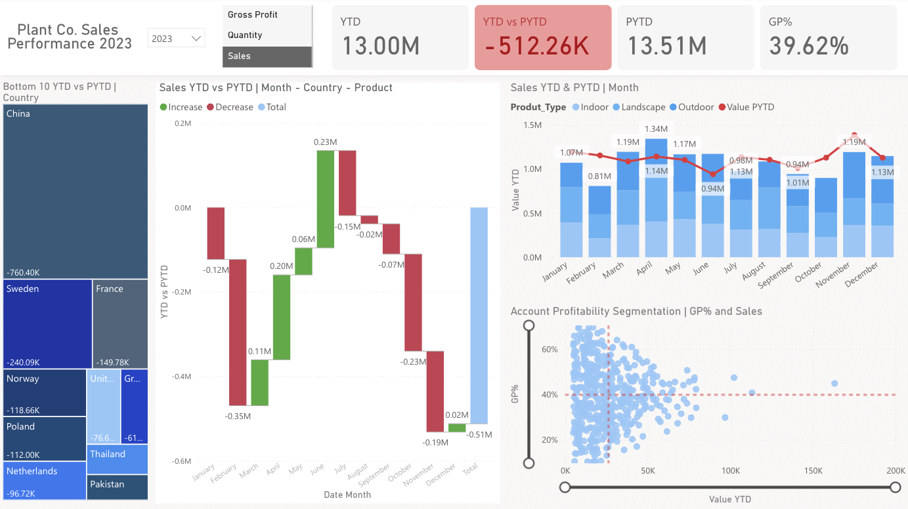
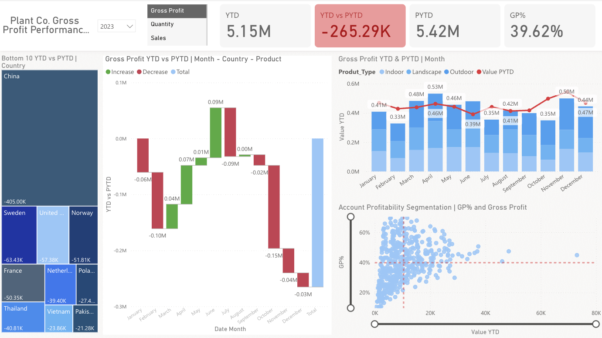
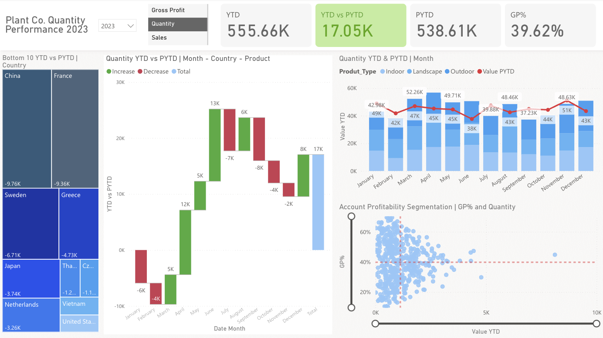
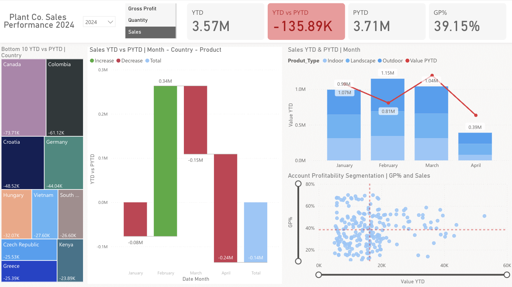
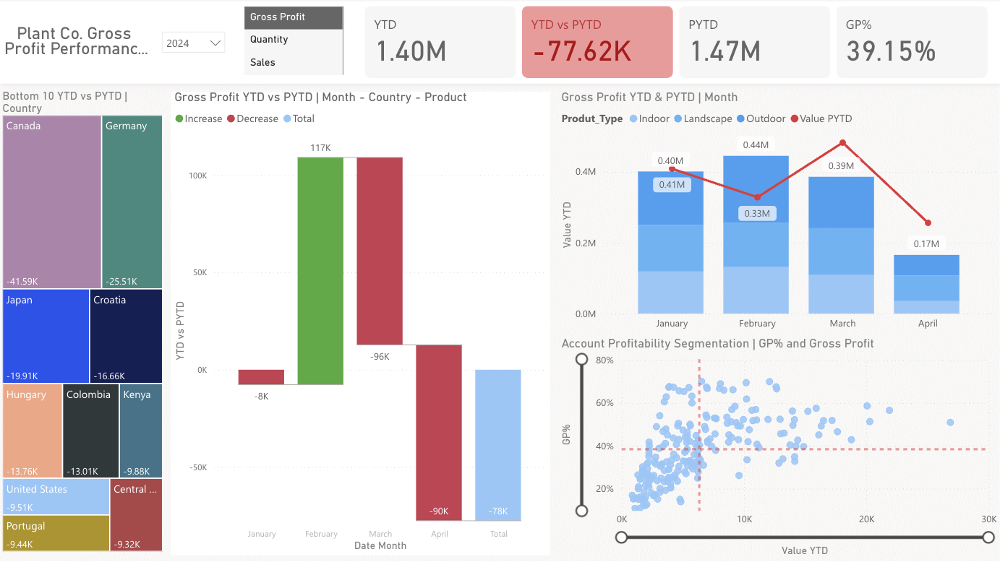
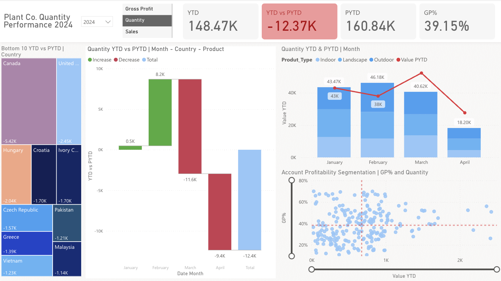

# PlantCo Performance Report | Power BI Portfolio Project

## Report Preview

| | |
|---|---|
|  |  |
|  |  |
|  |  |

## Project Overview

This project is an end-to-end business intelligence report built in Microsoft Power BI,
analysing the sales performance of a fictional plant company called PlantCo. The report
enables business users to compare current year-to-date performance against the same period
in the prior year, identify underperforming markets, and segment accounts by profitability.

The dataset is sourced from an Excel workbook containing three related tables: a sales fact
table, a customer accounts dimension table, and a product hierarchy dimension table. The
final output is a dynamic, interactive single-page performance report published to Power BI
Service.

## Tools Used

- Microsoft Power BI Desktop
- Power Query (built into Power BI)
- DAX (Data Analysis Expressions)
- Microsoft Excel (source data)
- Power BI Service (publishing)

## Dataset

The source file is a single Excel workbook with three tabs:

| Table | Type | Description |
|---|---|---|
| Plant Fact | Fact Table | Sales invoices including product ID, account ID, quantity, price, cost of goods, and invoice date |
| Accounts | Dimension Table | Customer account details including country, coordinates, and account ID |
| Plant Hierarchy | Dimension Table | Product catalogue with family, group, name, size, and type |

## Project Workflow

### 1. Data Cleaning in Power Query

- Renamed tables to follow a clear naming convention: `Fact_Sales`, `Dim_Account`, `Dim_Product`
- Removed duplicate rows from the unique identifier columns in both dimension tables to ensure data integrity
- Corrected column names that contained numbering artefacts (e.g. `Latitude 2`, `Country 2`)
- Confirmed that the `Date_Time` column in the fact table was formatted correctly as a date type

### 2. Data Modelling and Virtual Tables

After loading the cleaned tables, two additional tables were created directly in Power BI using DAX:

**Dim_Date — the Calendar Table**

A calendar table was created to cover the full date range of the dataset (1 January 2022 to
31 December 2024).

The sales table only has dates when a sale actually happened. The calendar table has every
single day, whether or not a sale occurred. Without it, months with no sales would simply
disappear from the charts instead of showing zero. Connecting the sales data to a complete
calendar is what makes reliable time-based analysis possible.

```dax
Dim_Date = 
CALENDAR(
    DATE(2022, 01, 01),
    DATE(2024, 12, 31)
)
```

**Inpast — the Prior Year Filter Column**

A calculated column was added to `Dim_Date` to flag whether each date falls within the prior
year window. This column is used as a filter in Prior Year-to-Date measures to prevent empty
future months from appearing alongside current year results.

```dax
Inpast = 
VAR lastsalesdate = MAX(Fact_Sales[Date_Time])
VAR lastsalesdatePY = EDATE(lastsalesdate, -12)
RETURN
Dim_Date[Date] <= lastsalesdatePY
```

**Slicer Values Table — the Switch Driver**

A small static table containing three values — Sales, Gross Profit, Quantity — was created
manually. This table powers the switch measures, allowing a single slicer to dynamically
change what all visuals display at once.

**Relationships**

Three relationships were established in the model view:

- `Dim_Date[Date]` to `Fact_Sales[Date_Time]`
- `Dim_Account[Account ID]` to `Fact_Sales[Account ID]`
- `Dim_Product[Product Name]` to `Fact_Sales[Product ID]`

### 3. DAX Measures

All measures were stored in a dedicated measures table to keep the model organised. Measures
were grouped into display folders by category.

**Base Measures**

```dax
Sales = SUM(Fact_Sales[Sales])

Quantity = SUM(Fact_Sales[Quantity])

COGS = SUM(Fact_Sales[COGS])

Gross Profit = [Sales] - [COGS]

GP% = DIVIDE([Gross Profit], [Sales])
```

**Year-to-Date Measures**

Year-to-date calculates the running total from the start of the selected year up to the most
recent invoice date. The fact table date column is used here rather than the calendar table,
so the calculation stops at the last actual sale rather than running to the end of the year.

```dax
YTD_Sales = TOTALYTD([Sales], Fact_Sales[Date_Time])

YTD_Quantity = TOTALYTD([Quantity], Fact_Sales[Date_Time])

YTD_Gross Profit = TOTALYTD([Gross Profit], Fact_Sales[Date_Time])
```

**Prior Year-to-Date Measures**

Prior year-to-date looks back exactly 12 months and calculates the same cumulative total for
the equivalent period last year. The `Inpast` column is applied as a filter to ensure only
comparable months are included.

```dax
PYTD_Sales = 
CALCULATE(
    [Sales],
    SAMEPERIODLASTYEAR(Dim_Date[Date]),
    Dim_Date[Inpast] = TRUE
)
```

The same pattern was applied for `PYTD_Quantity` and `PYTD_Gross Profit`.

**Switch Measures**

Switch measures allow a single slicer selection to update every visual on the page
simultaneously. Think of it like a universal remote — one button controls everything.

```dax
S_YTD = 
VAR selected_measure = SELECTEDVALUE(Slicer_Values[Values])
VAR result =
    SWITCH(
        selected_measure,
        "Sales", [YTD_Sales],
        "Gross Profit", [YTD_Gross Profit],
        "Quantity", [YTD_Quantity],
        BLANK()
    )
RETURN result
```

The same pattern was applied for `S_PYTD`.

**Comparison Measure**

```dax
YTD vs PYTD = [S_YTD] - [S_PYTD]
```

**Dynamic Titles**

Measure-driven titles were created so that chart headings update automatically based on the
slicer selection and year filter, keeping the report self-explanatory at all times.

### 4. Report Design and Visuals

The report uses a custom background image created in PowerPoint and imported as a canvas
background. This establishes a consistent header area and visual separation between sections.

| Visual | Purpose |
|---|---|
| New Card Visual (header metrics) | Displays YTD value, PYTD value, YTD vs PYTD comparison, and GP% at a glance |
| Treemap | Shows the bottom 10 countries by YTD vs PYTD to surface underperforming markets |
| Waterfall Chart | Breaks down the contribution of each month to the overall YTD vs PYTD gap |
| Line and Stacked Column Chart | Compares YTD and PYTD performance side by side over time, broken down by product type (Indoor, Landscape, Outdoor) |
| Scatter Chart with Zoom Slider | Segments accounts by GP% against the selected value metric, with average reference lines to identify high-value and low-profitability accounts |

**Conditional Formatting**

Conditional formatting was applied to the YTD vs PYTD card:
- Positive values display in green to indicate growth
- Negative values display in red to flag decline

This removes the need for the end user to interpret numbers — the colour communicates the
direction immediately.

**Slicers**

- Year slicer (dropdown) to select the year-to-date reference year
- Value slicer (list) to switch all visuals between Sales, Gross Profit, and Quantity

## Dashboard Breakdown

### 2023 Performance

#### Sales — 2023


- Total Sales YTD of **$13.00M** against a PYTD of **$13.51M**, resulting in a negative variance of **-$512.26K** flagged in red
- GP% held at **39.62%** across all metrics for the year
- China was the worst-performing country by a significant margin at **-$760.40K**, followed by Sweden (-$240.09K) and France (-$149.78K)
- The waterfall chart shows June as the strongest month (+$0.23M) but November as the steepest single-month decline (-$0.23M), with December closing at -$0.51M total variance
- The scatter chart shows most accounts clustered below $50K in sales, with a handful of outliers above $150K revealing a concentration risk in the customer base

#### Gross Profit — 2023


- Gross Profit YTD of **$5.15M** against PYTD of **$5.42M**, a negative variance of **-$265.29K**
- China remained the largest drag on gross profit (-$405.00K), with Sweden (-$63.43K), United States (-$57.38K), and Norway (-$51.81K) also in the bottom 10
- June and May were the strongest months for gross profit growth (+$0.09M and +$0.07M respectively), while August saw the sharpest single-month drop at -$0.15M
- The account profitability scatter shows a wide cluster of accounts below the 40% GP reference line, with a smaller group of higher-margin accounts sitting above it but with limited gross profit volume

#### Quantity — 2023


- Total quantity sold YTD was **555.66K** units against a PYTD of **538.61K**, a positive variance of **+17.05K** — the only metric to show growth in 2023
- China (-9.76K) and France (-9.36K) were the two worst-performing countries by quantity, followed by Sweden (-6.71K) and Greece (-4.73K)
- May and April were the strongest months for quantity growth (+12K and +5K respectively), while January and March declined (-6K and -4K)
- The monthly column chart shows March as the peak month at 52.26K units, with July as the lowest at 38K

### 2024 Performance

> Note: 2024 data covers January to April only, as the dataset runs through mid-year.

#### Sales — 2024


- Sales YTD of **$3.57M** against PYTD of **$3.71M**, a negative variance of **-$135.89K**
- GP% remains consistent at **39.15%**
- Canada was the worst-performing country (-$73.71K), followed by Colombia (-$61.12K) and Croatia (-$48.52K) — a notably different set of underperforming markets compared to 2023
- February was the strongest month (+$0.34M) before a sharp reversal in March (-$0.15M) and April (-$0.24M)
- The line chart shows PYTD (red line) tracking above YTD from February onward, indicating the gap widened through the available months

#### Gross Profit — 2024


- Gross Profit YTD of **$1.40M** against PYTD of **$1.47M**, a negative variance of **-$77.62K**
- Canada (-$41.59K) and Germany (-$25.51K) led the bottom 10 underperforming countries, joined by Japan, Croatia, Hungary, and Colombia
- February was the only growth month at +$117K, with March and April both declining sharply (-$96K and -$90K respectively)
- The scatter chart shows a notably wider spread of GP% compared to 2023, with several accounts achieving above 60% margin — suggesting a shift in the product or customer mix

#### Quantity — 2024


- Quantity YTD of **148.47K** units against PYTD of **160.84K**, a negative variance of **-12.37K** — a reversal from the quantity growth seen in 2023
- Canada (-5.42K) and United States (-2.45K) were the top underperformers, with Hungary, Croatia, and Ivory Coast also in the bottom 10
- February showed the only positive month at +8.2K units, with March (-11.6K) and April (-9.4K) both declining
- The PYTD line on the column chart tracks consistently above YTD values from February onward, confirming the downward trend across the available 2024 months

## Key Insights Across Both Years

- Sales and Gross Profit declined year-on-year in both 2023 and 2024, while Quantity grew slightly in 2023 before reversing in 2024 — suggesting pricing or mix pressure rather than pure volume loss
- China was the dominant drag on all three metrics in 2023; by 2024 the underperforming markets shifted to Canada, Colombia, and Croatia, pointing to a geographic spread of risk
- GP% remained remarkably stable at approximately 39.15–39.62% across both years and all three metrics, indicating consistent cost structure despite declining top-line performance
- The second half of available months consistently showed the largest declines, making Q3 and Q4 the highest-priority area for investigation

## Repository Structure
