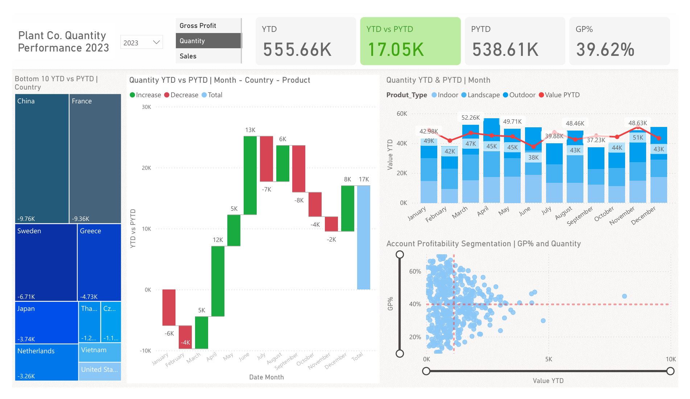

# PlantCo Performance Report | Power BI Portfolio Project

## Report Preview



---

## Project Overview

This project is an end-to-end business intelligence report built in Microsoft Power BI, analysing the sales performance of a fictional plant company called PlantCo. The report enables business users to compare current year-to-date performance against the same period in the prior year, identify underperforming markets, and segment accounts by profitability.

The dataset is sourced from an Excel workbook containing three related tables: a sales fact table, a customer accounts dimension table, and a product hierarchy dimension table. The final output is a dynamic, interactive single-page performance report published to Power BI Service.

---

## Tools Used

- Microsoft Power BI Desktop
- Power Query (built into Power BI)
- DAX (Data Analysis Expressions)
- Microsoft Excel (source data)
- Power BI Service (publishing)

---

## Dataset

The source file is a single Excel workbook with three tabs:

| Table | Type | Description |
|---|---|---|
| Plant Fact | Fact Table | Sales invoices including product ID, account ID, quantity, price, cost of goods, and invoice date |
| Accounts | Dimension Table | Customer account details including country, coordinates, and account ID |
| Plant Hierarchy | Dimension Table | Product catalogue with family, group, name, size, and type |

---

## Project Workflow

The project followed a four-stage structure:

### 1. Data Preparation in Power Query
The following steps were applied:

- Renamed tables to follow a clear naming convention: `Fact_Sales`, `Dim_Account`, `Dim_Product`
- Removed duplicate rows from the unique identifier columns in both dimension tables to ensure data integrity
- Corrected column names that contained numbering artefacts (e.g. `Latitude 2`, `Country 2`)
- Confirmed that the `Date_Time` column in the fact table was formatted correctly as a date type

### 2. Data Modelling and Virtual Tables

After loading the cleaned tables, two additional tables were created directly in Power BI using DAX:

**Dim_Date — the Calendar Table**

A calendar table was created to cover the full date range of the dataset (1 January 2022 to 31 December 2024).

Think of this like a wall calendar. Your sales table only has dates when a sale actually happened. The calendar table has every single day, whether or not a sale occurred. Without it, months with no sales would simply disappear from your charts instead of showing zero. Connecting your sales data to a complete calendar is what makes reliable time-based analysis possible.

```dax
Dim_Date = 
CALENDAR(
    DATE(2022, 01, 01),
    DATE(2024, 12, 31)
)
```

**Inpast — the Prior Year Filter Column**

A calculated column was added to `Dim_Date` to flag whether each date falls within the prior year window. This column is used as a filter in Prior Year-to-Date measures to prevent empty future months from appearing alongside current year results.

```dax
Inpast = 
VAR lastsalesdate = MAX(Fact_Sales[Date_Time])
VAR lastsalesdatePY = EDATE(lastsalesdate, -12)
RETURN
Dim_Date[Date] <= lastsalesdatePY
```

**Slicer Values Table — the Switch Driver**

A small static table containing three values — Sales, Gross Profit, Quantity — was created manually. This table powers the switch measures, allowing a single slicer to dynamically change what all visuals display at once.

**Relationships**

Three relationships were established in the model view:
- `Dim_Date[Date]` to `Fact_Sales[Date_Time]`
- `Dim_Account[Account ID]` to `Fact_Sales[Account ID]`
- `Dim_Product[Product Name]` to `Fact_Sales[Product ID]`

### 3. DAX Measures

All measures were stored in a dedicated measures table to keep the model organised. Measures were grouped into display folders by category.

**Base Measures**

```dax
Sales = SUM(Fact_Sales[Sales])

Quantity = SUM(Fact_Sales[Quantity])

COGS = SUM(Fact_Sales[COGS])

Gross Profit = [Sales] - [COGS]

GP% = DIVIDE([Gross Profit], [Sales])
```

**Year-to-Date Measures**

Year-to-date calculates the running total from the start of the selected year up to the most recent invoice date. The fact table date column is used here rather than the calendar table, so the calculation stops at the last actual sale rather than running to the end of the year.

```dax
YTD_Sales = TOTALYTD([Sales], Fact_Sales[Date_Time])

YTD_Quantity = TOTALYTD([Quantity], Fact_Sales[Date_Time])

YTD_Gross Profit = TOTALYTD([Gross Profit], Fact_Sales[Date_Time])
```

**Prior Year-to-Date Measures**

Prior year-to-date looks back exactly 12 months and calculates the same cumulative total for the equivalent period last year. The `Inpast` column is applied as a filter to ensure only comparable months are included.

```dax
PYTD_Sales = 
CALCULATE(
    [Sales],
    SAMEPERIODLASTYEAR(Dim_Date[Date]),
    Dim_Date[Inpast] = TRUE
)
```

The same pattern was applied for `PYTD_Quantity` and `PYTD_Gross Profit`.

**Switch Measures**

Switch measures allow a single slicer selection to update every visual on the page simultaneously. Think of it like a universal remote — one button controls everything.

```dax
S_YTD = 
VAR selected_measure = SELECTEDVALUE(Slicer_Values[Values])
VAR result =
    SWITCH(
        selected_measure,
        "Sales", [YTD_Sales],
        "Gross Profit", [YTD_Gross Profit],
        "Quantity", [YTD_Quantity],
        BLANK()
    )
RETURN result
```

The same pattern was applied for `S_PYTD`.

**Comparison Measure**

```dax
YTD vs PYTD = [S_YTD] - [S_PYTD]
```

**Dynamic Titles**

Measure-driven titles were created so that chart headings update automatically based on the slicer selection and year filter, keeping the report self-explanatory at all times.

### 4. Report Design and Visuals

The report uses a custom background image created in PowerPoint and imported as a canvas background. This establishes a consistent header area and visual separation between sections.

**Visuals included:**

| Visual | Purpose |
|---|---|
| New Card Visual (header metrics) | Displays YTD value, PYTD value, YTD vs PYTD comparison, and GP% at a glance |
| Treemap | Shows the bottom 10 countries by YTD vs PYTD to surface underperforming markets |
| Waterfall Chart | Breaks down the contribution of each month and product category to the overall YTD vs PYTD gap |
| Line and Stacked Column Chart | Compares YTD and PYTD performance side by side over time, with drill-down from quarter to month |
| Scatter Chart with Zoom Slider | Segments accounts by GP% against the selected value metric, with average reference lines to identify high-value and low-profitability accounts |

**Conditional Formatting**

Conditional formatting was applied to the YTD vs PYTD card:
- Positive values display in green to indicate growth
- Negative values display in red to flag decline

This removes the need for the end user to interpret numbers — the colour communicates the direction immediately.

**Slicers**

- Year slicer (dropdown) to select the year-to-date reference year
- Value slicer (list) to switch all visuals between Sales, Gross Profit, and Quantity

---

## Key Insights from the Report

The following insights are drawn from the 2023 Quantity view of the report:

- Total quantity sold in 2023 (YTD) was 555,660 units, against a prior year-to-date figure of 538,610 units — a positive variance of 17,050 units, indicating overall growth year on year
- Gross profit percentage held at 39.62%, providing a useful benchmark for account-level profitability analysis
- China and France were the two worst-performing countries by quantity YTD versus PYTD, declining by 9,760 and 9,360 units respectively — the largest drops in the bottom 10
- June and November were the strongest months for quantity growth versus the prior year, contributing +13K and +8K units respectively
- January, March, July, and September all fell below prior year levels, suggesting seasonal patterns that could inform future planning and stock management
- The account profitability scatter chart reveals a cluster of accounts sitting above the 40% GP average line but below average quantity, representing accounts with strong margins but untapped sales volume — a clear commercial opportunity

---

## Repository Structure

```
├── data/
│   └── Plant_DTS.xls           # Source Excel data file
├── screenshots/
│   ├── report_overview.png     # Full report screenshot
│   └── visuals_detail.png      # Close-up of key visuals
├── Plant_Performance_Report.pbix  # Power BI report file
└── README.md
```

---

## Learning Outcomes

Through this project the following skills were developed and applied:

- Cleaning and transforming data using Power Query
- Building a star schema data model with fact and dimension tables
- Writing DAX measures including TOTALYTD, SAMEPERIODLASTYEAR, CALCULATE, SWITCH, and SELECTEDVALUE
- Designing a multi-visual interactive report with dynamic titles and conditional formatting
- Publishing a report to Power BI Service
